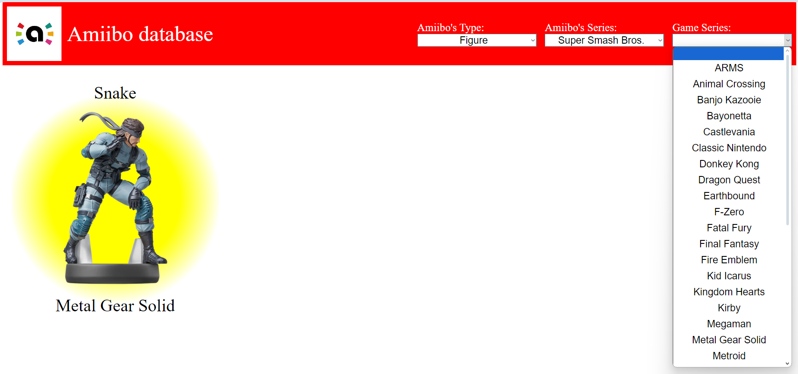

# MinProject1
This project presents working with site https://amiiboapi.com API to access into Nintendo's amiibo info database.

## Setup
Setuping of project needs to copy index.html, index.js and styles.css

## Run
Running of project needs to launch index.html in brouser with access to the Internet

## Branching strategy
This project had been developed by strategy of developemnt user interface in branch [WebPage](https://github.com/EvgenyPereguda/MinProject1/tree/WebPage) and code for getting data from site in branch [fetches-data](https://github.com/EvgenyPereguda/MinProject1/tree/fetches-data)
All features of project had been grouped in subbranches with forwarding "feature/". This project includes the next features: 
[feature/filtering](https://github.com/EvgenyPereguda/MinProject1/tree/feature/filtering)    
[feature/mobile_device](https://github.com/EvgenyPereguda/MinProject1/tree/feature/mobile_device)  